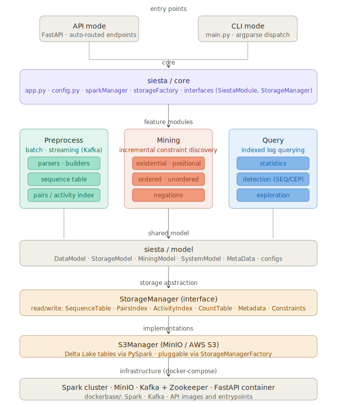

# Siesta Framework

Siesta is a Spark-based process mining and querying framework for event logs.
It can run as:
- an API server (FastAPI), or
- module-oriented CLI jobs (preprocess, mining, query).

Core data assumptions:
- `trace_id` is a string
- `activity` is a string
- `position` inside a trace is 0-indexed integer (derived from timestamp)

## What each module does

- `preprocess`: ingests batch/stream events and builds storage indexes/tables.
- `mining`: discovers constraints from stored traces.
- `query`: executes statistics/detection/exploration queries over indexed logs.

## Architecture


## Project layout

- `main.py`: top-level entrypoint.
- `siesta/core`: framework bootstrapping (config, Spark, storage factory, interfaces).
- `siesta/model`: shared schemas and typed config/data models (system, storage, mining/event structures).
- `siesta/modules`: feature modules (`Preprocess`, `Mining`, `Query`).
- `siesta/storage`: storage implementations (currently S3/MinIO-based).
- `config`: sample runtime and module config JSON files.
- `docker-compose.yml` + `siesta/dockerbase`: API + Spark + MinIO + Kafka stack.
- `tests`: integration/unit tests and test utilities.

## Dependencies

Requirements are split per submodule (`**/requirements.txt`).

Install all framework dependencies:

```bash
python3 siesta/install_dependencies.py
```

Install test dependencies:

```bash
python3 tests/install_dependencies.py
```

## Running Siesta

### 1. API mode

Default config (from siesta/model/SystemModel/DEFAULT_SYSTEM_CONFIG):

```bash
python3 main.py
```

Specific system config:

```bash
python3 main.py --config config/siesta.config.json
```

API routes are auto-registered from modules and exposed as:
- `POST /preprocessor/run`
- `POST /miner/run`
- `POST /query/run`

### 2. CLI module mode

General pattern:

```bash
python3 main.py --config <system_config.json> <module> <module_args>
```

Examples:

```bash
# Preprocess (batch/stream setup)
python3 main.py --config config/siesta.config.json preprocess --preprocess_config config/preprocess.config.json

# Mining
python3 main.py --config config/siesta.config.json mining --mining_config config/mining.config.json

# Query
python3 main.py --config config/siesta.config.json query --query_config config/query.config.json
```

## Configuration files

- `config/siesta.config.json`: local host-oriented system config.
- `config/siesta.docker.config.json`: container-network hostnames (`minio`, `kafka`, `spark-master`).
- `config/preprocess.config.json`: ingestion and field mappings.
- `config/mining.config.json`: mining categories, thresholds, output path.
- `config/query.config.json`: method and query payload.

## Docker (recommended for full stack)

Start API and dependencies:

```bash
docker compose up --build siesta-api
```

Use Docker-aware config explicitly (service-to-service hostnames):

```bash
SIESTA_CONFIG=/workspace/config/siesta.docker.config.json docker compose up --build siesta-api
```

This starts:
- `siesta-api`
- `spark-master`, `spark-worker`, `spark-worker2`
- `minio`
- `kafka`, `zookeeper`

`siesta/dockerbase` contains image definitions and entrypoints used by compose:
- `API/`: API container image and startup script.
- `Spark/`: Spark image and logging config.
- `Kafka/`: Kafka image and startup script.

## Extending Siesta (developer hints)

### Add a new module

1. Create `siesta/modules/<YourModule>/main.py`.
2. Implement a class that extends `SiestaModule`:
	- set `name` and `version`
	- implement `startup()`
	- implement `cli_run(args, **kwargs)`
	- optionally implement `register_routes()` for API endpoints
3. Add module-specific dependencies in `siesta/modules/<YourModule>/requirements.txt`.

Module discovery is automatic from `siesta.modules.*.main`.

### Add a new storage backend

1. Implement a new class extending `StorageManager` (see `siesta/core/interfaces.py`).
2. Add it under `siesta/storage/<Backend>/`.
3. Register it in `StorageManagerFactory._registry` (in `siesta/core/storageFactory.py`).
4. Set `storage_type` in system/module config to your backend key.

## Practical run order

1. Run preprocess on a log.
2. Run mining/query on the same `log_name` and `storage_namespace`.
3. Check outputs under `output/` (and persisted data in configured storage).
