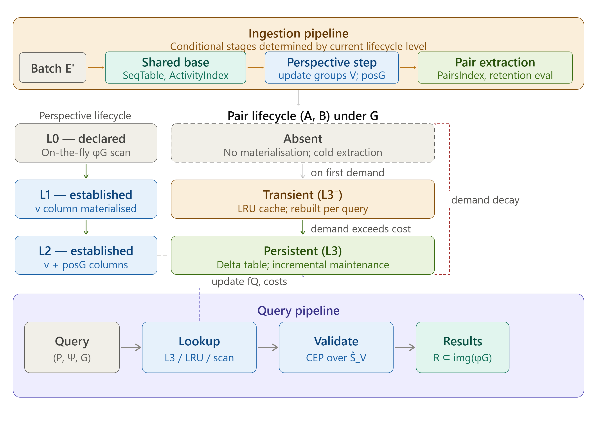

# Siesta Framework

Siesta is a Spark-based process mining and querying framework for event logs.
It can run as:
- an API server (FastAPI), or
- module-oriented CLI jobs (Index, mining, query, adaptive indexing, adaptive query).

Core data assumptions:
- `trace_id` is a string
- `activity` is a string
- `position` inside a trace is 0-indexed integer (derived from timestamp)

## What each module does

- `Index`: ingests batch/stream events and builds storage indexes/tables (eager pair materialization).
- `mining`: discovers constraints from stored traces.
- `query`: executes statistics/detection/exploration queries over indexed logs (eager).
- `adaptive_index`: ingests batch/stream events and maintains a workload-driven, multi-level index (see below).
- `adaptive_query`: executes detection/exploration/statistics queries against the adaptive index, with transparent fallback to eager processors.

## Architecture


## Project layout

- `main.py`: top-level entrypoint.
- `siesta/core`: framework bootstrapping (config, Spark, storage factory, interfaces).
- `siesta/model`: shared schemas and typed config/data models (system, storage, mining/event/perspective structures).
- `siesta/modules`: feature modules (`Index`, `Mining`, `Querying`, `adaptive_index`, `adaptive_query`).
- `siesta/storage`: storage implementations (currently S3/MinIO-based).
- `config`: sample runtime and module config JSON files.
- `docker-compose.yml` + `siesta/dockerbase`: API + Spark + MinIO + Kafka stack.
- `tests`: integration test utilities and the evaluation harness (`tests/vldb_eval`).

## Dependencies

Requirements are split per submodule (`**/requirements.txt`).

Install all framework dependencies:

```bash
python3 siesta/install_dependencies.py
```

Install test dependencies:

```bash
python3 tests/install_dependencies.py
```

## Running Siesta

### 1. API mode

Default config (from siesta/model/SystemModel/DEFAULT_SYSTEM_CONFIG):

```bash
python3 main.py
```

Specific system config:

```bash
python3 main.py --config config/siesta.config.json
```

API routes are auto-registered from modules and exposed as:
- `POST /indexing/run` — eager indexer
- `POST /mining/run`
- `POST /querying/run` — eager query
- `POST /adaptive_indexing/run` — adaptive indexer (ingest)
- `POST /adaptive_indexing/register-perspective` — declare a grouping perspective at L0 without ingesting
- `POST /adaptive_querying/run` — adaptive query (detection/exploration/stats), falls back to the eager processors when no `grouping_keys` are supplied

### 2. CLI module mode

General pattern:

```bash
python3 main.py --config <system_config.json> <module> <module_args>
```

Examples:

```bash
# Index (batch/stream setup) — eager
python3 main.py --config config/siesta.config.json Index --index_config config/Index.config.json

# Mining
python3 main.py --config config/siesta.config.json mining --mining_config config/mining.config.json

# Querying — eager
python3 main.py --config config/siesta.config.json query --query_config config/query.config.json

# Adaptive indexing
python3 main.py --config config/siesta.config.json adaptive_index --index_config config/adaptive_index.config.json
```

## Adaptive modules

The adaptive modules (`adaptive_index`, `adaptive_query`) replace the "index everything eagerly" model with a
workload-driven lifecycle: structure is built only as queries and ingest demand justify its cost, and decays back
down when demand stops.

### Lifecycle levels

Each declared grouping **perspective** (e.g. grouping by `org:resource`), and each `(A, B)` activity pair under an
established perspective, sits at one of the following levels, refining the physical layout monotonically:

| Level | Name | What exists |
|---|---|---|
| L0 | Perspective declared | Only the grouping function is registered; queries scan the flat event store and extract pairs on the fly. |
| L1 | Perspective established (pos-free) | The grouping value is materialized as a column on the `SequenceTable`, enabling partition-pruned scans. No positional annotation. Sufficient for any query whose constraints don't reference `pos`. |
| L2 | Perspective established (pos) | Adds materialized positional attributes plus `SequenceMetadata` so incremental updates extend positions correctly — needed for structural/positional predicates. |
| L3 | Pair persisted | A specific `(A, B)` pair has a full `PairsIndex` Delta table entry with `LastChecked` rows and incremental maintenance on every ingest. |
| L3⁻ | Pair cached (transient) | An intermediate tier: the pair is built on demand from the `SequenceTable`, held in a bounded LRU cache across queries, and evicted when the cache fills. Absorbs repeat queries on pairs that haven't crossed the retention threshold yet, without paying for full incremental maintenance. |

Promotion (`ABSENT → TRANSIENT → PERSISTENT`, i.e. `L0/L1/L2 → L3⁻ → L3`) and demotion (`L3 → L3⁻`, with LRU
eviction handling the final `L3⁻ → ABSENT` transition) are governed by a retention cost function evaluated on
every ingest and on first query touch (synchronous "backstop" promotion).

### Key components

- `catalog.py` — `PerspectiveCatalog`: tracks per-perspective and per-pair lifecycle state and workload statistics.
- `retention.py` — `RetentionPolicy`: stateless predicate evaluator deciding promotion/demotion based on accumulated
  query savings, half-life decay, and hysteresis.
- `builders.py` — promotion routines (`promote_to_l1`, `promote_to_l2`, `build_pair_transient`) and incremental
  maintenance.
- `lru_cache.py` — `PairLRUCache` / `get_lru_cache`: bounded, process-wide LRU cache for L3⁻ pairs, keyed by
  `(perspective_id, act_a, act_b)`, with per-`(storage_namespace, log_name)` registries.
- Adaptive query planner (`adaptive_query` module `main.py`) — for each pair required by a pattern: reads the Delta
  table if `PERSISTENT`, serves/rebuilds via the LRU cache if `TRANSIENT`, or falls back to a lazy scan if `ABSENT`
  (timing the cold-start cost as input to the retention policy). Detection/exploration share the same pruning + CEP
  validation logic as the eager modules, keyed on the grouping value instead of `trace_id`.

### Configuration

`config/adaptive_index.config.json` extends the eager indexer config with:
- `perspectives`: a list of `{"grouping_keys": [...]}` specs declared proactively at L0 on ingest.
- `half_life_seconds`, `min_query_count`, `hysteresis`: retention policy knobs (also overridable per-request on the
  query side via `QueryConfig`, useful for testing/evaluation).

Perspectives can also be registered without ingesting via `POST /adaptive_indexing/register-perspective`; they're
promoted to L1 lazily on first matching query, or proactively on the next ingest if retention predicates warrant it.

### Fallback behavior

`adaptive_query` only engages the adaptive planner when the request includes `grouping_keys`. Without them, it
delegates entirely to the existing eager query processors, so `/querying/run` (eager) and `/adaptive_querying/run`
(adaptive) can be exposed side by side with no interference.

## Configuration files

- `config/siesta.config.json`: local host-oriented system config.
- `config/siesta.docker.config.json`: container-network hostnames (`minio`, `kafka`, `spark-master`).
- `config/Index.config.json`: eager ingestion and field mappings.
- `config/adaptive_index.config.json`: adaptive ingestion, perspective declarations, retention policy knobs.
- `config/mining.config.json`: mining categories, thresholds, output path.
- `config/query.config.json`: method and query payload (eager).

## Docker (recommended for full stack)

Start API and dependencies:

```bash
docker compose up --build siesta-api
```

Use Docker-aware config explicitly (service-to-service hostnames):

```bash
SIESTA_CONFIG=/workspace/config/siesta.docker.config.json docker compose up --build siesta-api
```

This starts:
- `siesta-api`
- `spark-master`, `spark-worker`, `spark-worker2`
- `minio`
- `kafka`, `zookeeper`

`siesta/dockerbase` contains image definitions and entrypoints used by compose:
- `API/`: API container image and startup script.
- `Spark/`: Spark image and logging config.
- `Kafka/`: Kafka image and startup script.

## Running tests

Test infrastructure lives under `tests/`, including the evaluation harness in `tests/vldb_eval`. It is an
HTTP-driven integration suite: it talks to a running Siesta API instance over `localhost:8000` (override with the
`API_BASE` setting in `tests/vldb_eval/eval_common.py`, or per-run via the env vars below), so **start the API
stack first** (`docker compose up --build siesta-api`, or `python3 main.py` locally with Spark/MinIO reachable).

Install test dependencies once:

```bash
python3 tests/install_dependencies.py
```

### Running an experiment

There is no master runner — each experiment is a standalone script under `tests/vldb_eval/`, run as a plain Python
file (not a `-m tests.vldb_eval.*` module) and taking its own `--dataset`/`--log-name` flags where applicable:

```bash
# Run against the default dataset:
python tests/vldb_eval/exp_warmup.py

# Run against a specific real-world dataset:
python tests/vldb_eval/exp_warmup.py --dataset datasets/bpic_2017.xes --log-name bpic_2017
```

Dataset resolution precedence (via `eval_common.resolve_dataset`): explicit CLI args (`--dataset`/`--log-name`) >
env vars (`EVAL_DATASET`/`EVAL_LOG_NAME`) > defaults in `eval_common.py`. `--datasets-dir <dir>` (where supported)
points at a directory of candidate datasets instead of a single file.

Core experiments:

| Label | Script | What it checks |
|---|---|---|
| `6.3.1` | `exp_warmup.py` | Latency warm-up curve as pairs move `ABSENT → TRANSIENT → PERSISTENT` under repeated queries. |
| `6.3.2` | `exp_skew_vs_uniform_latency.py` | Query-latency convergence under skewed vs. uniform workloads. |
| `6.3.3` | `exp_lru_eviction.py` | Demand concentration vs. LRU eviction — skewed streams promote hot pairs fast; uniform streams spanning more pairs than the LRU capacity stay permanently cold. |
| — | `exp_maintenance_savings.py` | Eager (pre-built, per-perspective) vs. adaptive incremental maintenance cost as the number of perspectives grows. |
| `6.4` | `exp_compare.py` | Competitive comparison against eager SIESTA and an ELK baseline (hardcoded dataset list and endpoints at the top of the script). |
| `6.4.2` | `exp_expressiveness.py` | Demonstrates pattern operators adaptive SIESTA supports that ELK/`MATCH_RECOGNIZE` cannot express, plus warm-state latency on those queries. |
| — | `exp_mr.py` | Flink `MATCH_RECOGNIZE` counterpart of the multiperspective evaluation — isolates the cost of re-partitioning per perspective (needs `docker compose -f tests/vldb_eval/docker-compose-flink.yml up -d`). |
| — | `exp_multiperspective.py` | Shows the same pattern query yields meaningfully different results across simultaneously maintained perspectives. |

Supporting scripts in `tests/vldb_eval`: `query_generator.py` / `workload.py` (data-driven workload construction
from real co-occurring pairs via pair-coverage introspection — avoid hand-rolled random pairs, they tend to produce
empty results), `batch_splitter.py` (splits a log into N ingest batches: temporal, trace-sample, or synthetic),
`generate_eval_dataset.py` / `generate_competitive_dataset.py` (synthetic log generation tuned for the eval suite),
and `inspect_datasets.py` (standalone schema/perspective discovery, no API/Spark required).

Each experiment's JSONL output records one event per line (query, ingest batch, promotion, etc.) under a common
envelope (`experiment`, `run_id`, `ts`, `event`, plus event-specific fields), written to `tests/eval/results/` by
default (falling back to `tests/vldb_eval/results/` if that path isn't writable) — plotting scripts read these
without re-running the experiments.

Useful environment variables:
- `EVAL_DATASET` / `EVAL_LOG_NAME`: dataset path / log name (see precedence above).
- `EVAL_API_TIMEOUT`: per-request HTTP timeout in seconds for the eval client (default `1800`; large real-world
  datasets can take well over the default for a single ingest/query call).

## Extending Siesta (developer hints)

### Add a new module

1. Create `siesta/modules/<YourModule>/main.py`.
2. Implement a class that extends `SiestaModule`:
	- set `name` and `version`
	- implement `startup()`
	- implement `cli_run(args, **kwargs)`
	- optionally implement `register_routes()` for API endpoints
3. Add module-specific dependencies in `siesta/modules/<YourModule>/requirements.txt`.

Module discovery is automatic from `siesta.modules.*.main`.

### Add a new storage backend

1. Implement a new class extending `StorageManager` (see `siesta/core/interfaces.py`).
2. Add it under `siesta/storage/<Backend>/`.
3. Register it in `StorageManagerFactory._registry` (in `siesta/core/storageFactory.py`).
4. Set `storage_type` in system/module config to your backend key.

## Practical run order

1. Run `Index` (eager) or `adaptive_index` on a log.
2. Run `mining`/`query`/`adaptive_query` on the same `log_name` and `storage_namespace`.
3. Check outputs under `output/` (and persisted data in configured storage).
4. For development, run the relevant `tests/vldb_eval` experiments against a running API instance before relying
   on adaptive-path results.
